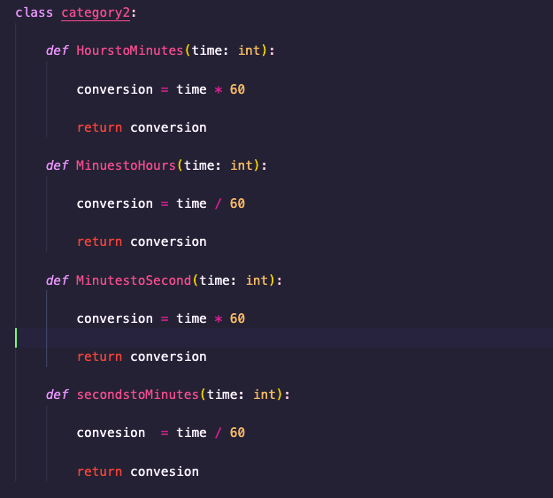
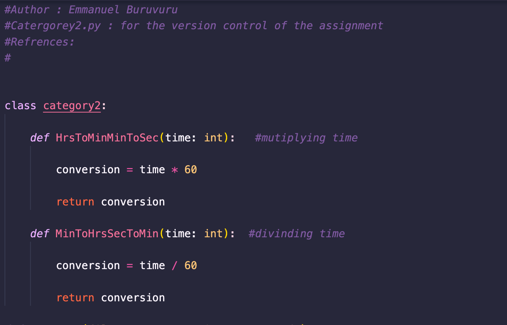

# Introduction to Software Engineering 
# Buruvuru Emmanuel ID 20750194 
# 23/05/2022 

# Introduction 
--

The assingment has covered a lot of asspects for Software version control , testing and ethics. Code implementations include code for the category one that has functions to convert a given string to Upper case and to lower case, to determine if the string contains a a numeric value and to remove a numeric values in a given string. Category two covers the implementation of conversion of the time unit from Hours to Minutes and vise-versa and Minutes to Seconds and vise-versa. All the code where then tested using white and black box test after they had passed the modularuty requirement check. 

# Module Descriptions 
--

## Category 1 

Catergory1.py - A file that contains a class to convert a string to various variations and edit the string . 

* Function1 -> UppertoLower() used to convert a string from lowercase to uppercase it returns a string.
* Function2 -> LowertoUpper() used to convert a string from Uppercase to Lowecase it returs a string.
* Function3 -> NumericsinString() used to see if a string has a digit contained in it it returs a string.
* Function4 -> isString_Valid() used to see if a string is a valid number it returs a boolen. 
* Function5 -> remove_numerics() used to remove a numeric value in a string and convert that string to lower or upper case via user input it returs a string

## Category 2 

Catergory2.py - A file that contains a class that converts given time from Hours to minutes and vise-versa and Minutes to seconds and vis-versa. 

* Function1 -> HourstoMinutes() converts a hours to minutes returns a float.
* Function2 -> HourstoMinutes() converts minutes to hours returns a float.
* Fuction3 -> SecondestoMinutes() converts seconds to minutes returns a float. 
* Funtion4 -> MinutestoSeconds() converts minutes to seconds returns a float. 
* Functuon5 -> SaveData() a function that takes in four arguments(filename , Hours , minutes, seconds) and then uses the functions to do the conversions and save the in the file name.

File.txt - saved data from the time conversion methods.

# Modularity 
--

## Modularity checklist 

1. Is the system free of global variables ->  No global variables in the submodules.  
1. Is each submodule free of control flags – > The submodules are free from control flags. 
1. Does each submodule perform a well-defined task -> Yes. 
1. Do each submodule Deal with the same data -> 
1. If it’s free of duplicate modules –> The submodules have duplicate code in category2.py conversions. 
1. Do submodules not perform overlapping tasks-> Yes, submodules don't perform overlapping tasts. 

### Fixing Duplicate code 

The code had duplicate codes and this wans not satisfying the checklist so the conde was fixed to fix this modularity error. 

The code was then fixed so that it does not contain duplicate codes. The function that had the duplicate codes where merge into one to archive a more efficiet code we just have to change the code that we have edited in this section. 

# Black Box test case 
--

# White Box test case 
--

# Test Implimentation and execution
--

# Version Control 
--
# Ethics 
--

# Discuission
--

