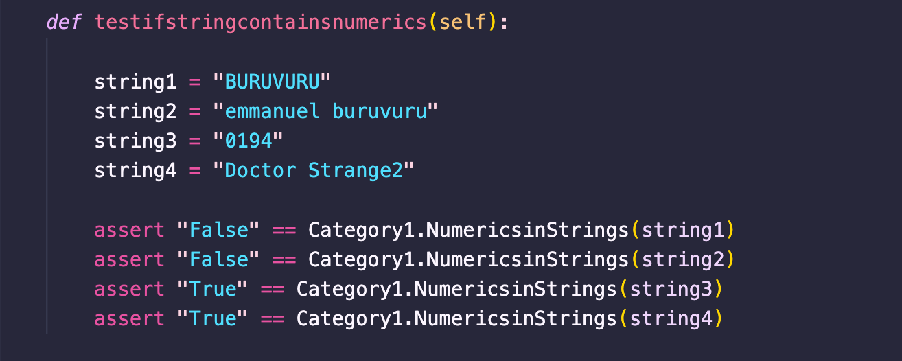
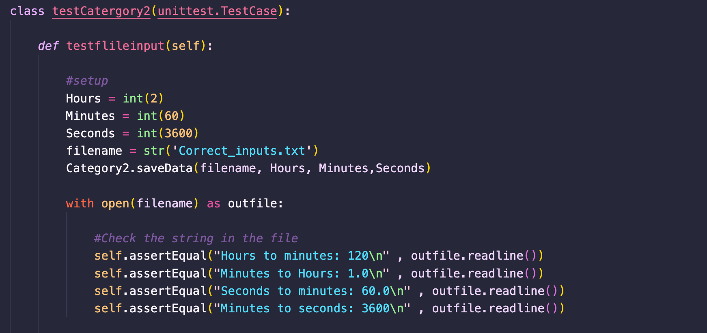

# Introduction to Software Engineering 
# Final Assignment Report  
# Buruvuru Emmanuel ID 20750194 
# 23/05/2022 

# Introduction 

This report addresses aspects of software production covering test implementation, version control, black box testing, white box testing, modularity and lastly ethics. Code implementations include code for the category one that has functions to convert a given string to Upper case and to lower case, to determine if the string contains a numeric value and to remove a numeric value in each string and then convert that string to upper case. Category two covers the implementation of conversion of the time unit from Hours to Minutes and vise-versa and Minutes to Seconds and vise-versa. All the code where then tested either using white box testing or black box testing after they had passed the modularity requirement check list. A discussion is later reviewed at the end of the report on what the program could have done to improve the code for future improvements.

# Preliminary Descriptions 

## Category 1 

Catergory1.py - A file that contains a class to convert a string to various variations and edit the string. It is also used to verify if a string contains numeric values.

#### Function1

* Name: UppertoLower.
* Description: Used to convert a string from lowercase to uppercase. Input: Takes in a string parameter.
* Output: Returns a string.
* 

#### Function2

* Name: LowertoUpper()
* Description: Used to convert a string from Uppercase to lower case. Input: Takes in a string parameter.
* Output: Returns a string

#### Function3

* Name: NumericsinString()
* Description: used to see if a string has a digit contained in it.
*  Input: Takes in a string parameter.
* Output returns a Boolean (True / False).

#### Function4

* Name: IsStringValid_number()
* Description: used to see if a string is a valid number. Input: Takes in a string parameter
* Output: It returns a Boolean (String is a valid number. / String is not a valid number.).

#### Function5
* 
* Name: remove_numerics()
* Description: used to remove a numeric value in a string and convert that string to upper case via user input. Input: Takes in a string parameter
* Output: returns the inputted string as uppercase.

## Category 2 

Catergory2.py - A file that contains a class that converts given time from Hours to minutes and vise-versa and Minutes to seconds and vis-versa.

#### Function1

* Name: HrsToMinMinToSec()
* Description: Converts hours to minutes and minutes to seconds, it checks if the number is not a negative number, and the inputted number is not equal to zero and then multiply the time unit with 60.
* Input: keyboard input or passed as a parameter in the function. Output: returns a float value of the conversion.

#### Function2

* Name: MinToHrsSecToMin()
* Description: Converts a minute to hours and seconds to minutes, it checks if the number is not a negative number, and the inputted number is not equal to zero and then divides the time unit by 60.
* Input: keyboard input or passed as a parameter in the function. Output: returns a float value of the conversion.

#### Function3

* Name: SaveData()
* Description: function that takes in four arguments (filename, Hours, minutes, seconds) and then uses the functions to do the conversions and save the results in the file name.
* input: passed as a parameter in the function.
* Output: writes floats into a filename with the conversion units.

# Modularity 

## Modularity checklist 

1.	Is the system free of global variables -> No global variables in the submodules?
2.	Is each submodule free of control flags – > The submodules are free from control flags.
 
3.	Does each submodule perform a well-defined task -> Yes?
4.	Do each submodule Deal with the same data -> Yes.
5.	If it’s free of duplicate modules –> The submodules have duplicate code in category2.py conversions.
6.	Do submodules do not perform overlapping tasks-> Yes, submodules don't perform overlapping tasks.
 

### Fixing Duplicate code 

 

The code had duplicate codes and this was not satisfying the checklist, so the code was fixed to fix this modularity error.

 

The code was then fixed so that it does not contain duplicate codes. The function that had the duplicate codes where merge into one to archive a more efficient code we just must change the code that we have edited in this section.

The modularity check list was passed and then the production code was ready.

# Black Box test case 

## Equivalence Testing. 

### LowerCase to  UpperCase function.

| Category        | Test Data        | Expected data     |
|-----------------|------------------|-------------------|
|lowerCase string |emmanuel buruvuru | EMMANUEL BURUVURU |
|UpperCase string | BURUVURU         |       BURUVURU    |
|Not a string     | 0194             |            ""     |
|Lower and upper  | Doctor Strange   | DOCTOR STRANGE    | 

### UpperCase to LowerCase function.

| Category        | Test Data        | Expected data     |
|-----------------|------------------|-------------------|
|lowerCase string |emmanuel buruvuru | emmanuel buruvuru |
|UpperCase string | BURUVURU         |       buruvuru    |
|Not a string     | 0194             |            ""     |
|Lower and upper  | Doctor Strange   | doctor strange    | 

### Is String a valid number function. 

| Category        | Test Data        | Expected data     |
|-----------------|------------------|-------------------|
|lowerCase string |emmanuel buruvuru | "String is not a valid number.." |
|UpperCase string | BURUVURU         |       "String is not a valid number.."    |
|Valid number     | 0194             |"String is a valid number.."    |
|String with a number  | Doctor Strange2   | "String is not a valid number.."    | 
|Valid number with letter| 10.e       | "String is a valid number" |  

### Remove numbers in a string and change string to UpperCase function. 

| Category        | Test Data        | Expected data     |
|-----------------|------------------|-------------------|
|String without a number |emmanuel buruvuru | "final string: EMMANUEL BURUVURU"|
|A number   | 0194             |            "final string:  "    |
|Lower and upper string with number | Doctor Strange2   | "final string: DOCTOR STRANGE"   | 

### Numeric values in a string function. 

| Category        | Test Data        | Expected data     |
|-----------------|------------------|-------------------|
|String without numerics |emmanuel buruvuru | "False" |
|UpperCase string | BURUVURU         |       "False"    |
|A valid number    | 0194             |            "True"     |
|String with a numeric value  | Doctor Strange2   | "True" | 

## Boundary value analysis

### HrsToMinMinToSec function. 

| Boundary        | Test Data        | Expected Result   |
|-----------------|------------------|-------------------|
|less than zero/sero| -1 / 0         | "input a positive int" \  "Number should not be zero" | 
|zero/valid       | 0 / 1 hour       | "Number should not be zero" \ "60" | 
|valid hours/ valid minutes| 2 hours /  120min | 120 / 7200| 

### MinToHrsSecToMin function. 

| Boundary        | Test Data        | Expected Result   |
|-----------------|------------------|-------------------|
|less than zero/zero| -1 / 0         | "input a positive int" \  "Number should not be zero" | 
|zero/valid       | 0 / 1 min       | "Number should not be zero" \ "60 " | 
|valid hours/ valid minutes| 2 hours /  120min | "120"  / "7200"| 

# White Box test case 

White box testing was implemented on the Module Catergory1.py on two functions. The testing was done by taking the keyboard input and the asserting if the function will return the anticipated output.
### Testing the function numericstring from the modulue catergory.py

### Testing the function remove_numerics from module Catergory.py

### Results

Results generated by running the Unit test testing framework imported in the testing module as Testcase:

# Test Implimentation and execution

Production code file        | Submodule.          | Testing file.    |
--------------------|------------------|-----------------------|
| category1.py     |  LowertoUpper | Category1_Unittest.py| 
| category1.py     |  UppertoLower | Category1_Unittest.py|
| category1.py     |  NumericsinStrings  | Category1_Unittest.py|
| category1.py     |  IsStringValid_number | Category1_Unittest.py|
| category1.py     |  remove_numeric | Category1_Unittest.py|
| category2.py     |  HrsToMinMinToSec | Category2_Unittest.py
| category2.py     | MinToHrsSecToMin  | Category2_Unittest.py
| category2.py     | saveData          | Category2_Unittest.py

## Category1.py test inplementation.

The testing of the module Catergory1.py was done with Black box equivalence testing using the unit test frame to assert and check whether the values were used in the functions were putting out the right output.

#### Testing Function 1: 

Testing lower to upper case was done by asserting the expected output to the function LowertoUpper. 

### Testing Function 2: 

Testing upper to lower case was done by asserting the expected output to the function and comparing the returned string.

### Testing Function 3: 

The function of testing if there are numeric in a string was done with the assertion function since, we know the output of the function as it is returning a Boolean. 

 

### Testing Function 4: 

The function of validating if a string is a valid number or not was tested by taking input from the keyboard and the assessing if the inputs string is a valid number of not. This was done by capturing the input that the user puts and the using the function to validate the string.

### Testing Function 5: 

lastly in the category module one had to test the function that will check if a string contains a number and the remove the number returning the string in UPPERCASE. The function was tested by taking capturing the output of the returned string after passing a string into the function.

 

### Results

Results generated by running the Unit test testing framework imported in the testing module as Testcase:

## Category2.py test inplementation.

Testing of the module category2.py was done by reading the output from a file that the function save Data () writes to. The function save Data takes in input as a parameters that include filename (where the data is being saved), Hours , minutes and seconds and calls function one and two to perform the conversions.

### Testing Function 1: 

The function HrsToMinMinToSec() converts a given time unit by multiplying the unit by 60 and return a float as a conversion result. It takes in hours and minutes as time units and coverts them from hours to min and from minutes to seconds. This function is tested by outputting the conversion into a file and then asserting the file to the expected output.

### Testing Function 2: 

The function MinToHrsSecToMin() converts a given time unit by dividing the unit by 60 and return a float as a conversion result. It takes in minutes and seconds as time units and coverts them from minutes to Hours and from seconds to minutes. This function is tested by outputting the conversion into a file and then asserting the file to the expected output.

### Testing Results:
 
Results generated by running the Unit test testing framework imported in the testing module as Testcase:

## MODULE EXECUTION 

| Module name|BB test design(EP)|BB test design(BVA)|WB test design|EP test code (implemented/ run)|BVA test code(implemented/run)| White-Box testing (implemented/run)|  
|-----------|---------|----------|---------|-----------|----------|------------| 
|Catergory1.py| Done | Not done  | Done    | Done      | Not done | Done       | 
|Catergory2.py| Not Done | Done  | Done    | Not Done  | Done     | Done       |

# Version Control 

Git was used throughout the assignment in tracking all the changes of the files. The git repository was initialized and set to be modified by Emmanuel as the user. A log is shown below of the commits done through the assignment. The full git directory has been attached for more information of the local git repository.

 
 

# Ethics 

## Ethical and professional misconduct

### Scenario 1: 

A software developer who is doing the time conversion should be aware of using the right module. If a user does not use the right module for the conversion, it would return a wrong value hence leading to disaster for instance, if the module was being used to convert a time from hours to minutes to get a precise time for an impact. The conversion might lead to the event happening sooner than expected and people won't be prepared for the impact in the worse scenario people might be killed if it was used to countdown the impact of a meteor. The event might be delayed because the user might have used the time unit multiplier instead of dividing the time unit given, leading to losses as preparation of an impact might cost a lot of money for example impact of a meteor, putting all the measures in place to reduce the impact of the meteor might cost money and releasing the impact is delayed might result in re-evaluation.

### Scenario 2:

A software developer might not think its different to implement conversion from upper case to lower case by using the UppercasetoLower() function in the catergory1.py module. If he is asked to run through a database and covert names if any that have upper case to lower case. He might omit it since he thinks it does not make any difference according to his knowledge. But the database can be run by an algorithm that does not register names that have an uppercase letter in the string hence, people might be omitted from the registration process. The software developer is doing not use the code ethically and did not protect people that were omitted by the system.

## ACS Code of Professional Conduct 

### Honesty 

The person who is using the code must be honest on what are the abilities of the program to the client. I should not intentionally mislead a customer or potential client about a product's or service's appropriateness, for instance the clients want a program that then converts the converted time unit to suit a schedule by using an API. I should tell the client that the program is not capable of doing such task. 

### The enhancement of life quality. 

The code that was designed to contribute to a good life for others for instance if one is in a mathematical situation where it is requires to change time units. If he does not have a calculator or the internet available to him, he might use the code to make the desired conversion and get required results.
 

# Discussion

In conclusion, the production code was designed successfully and met the requirements when provided the parameters to execute the functions (seen in the test cases). Modules could have been separated into different files to ensure proper testing of the modules separately.

