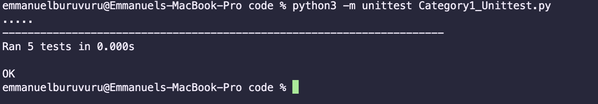

# Introduction to Software Engineering 
# Final Assignment Report  
# Buruvuru Emmanuel ID 20750194 
# 23/05/2022 

# Introduction 

This report addresses assepcts of software production covering test implementation, version control, black box testing, white box testing, modularity and lastly ethics. Code implementations include code for the category one that has functions to convert a given string to Upper case and to lower case, to determine if the string contains a numeric value and to remove a numeric values in a given string and then convert that string to upper case. Category two covers the implementation of conversion of the time unit from Hours to Minutes and vise-versa and Minutes to Seconds and vise-versa. All the code where then tested either using white box testing or black box testing after they had passed the modularuty requirement check list. A disccussion is later on reviewd at the end of the report on what the program nad the testing frames lack for future inprovements. 

# Peliminary Descriptions 

## Category 1 

Catergory1.py - A file that contains a class to convert a string to various variations and edits the string . 

#### Function1

* Name: UppertoLower. 
* Descritption: Used to convert a string from lowercase to uppercase it returns a string.
* Input: Takes in a string pararmeter. 
* Output: Returns a string. 

#### Function2

* Name: LowertoUpper() 
* Description: Used to convert a string from Uppercase to Lowecase it returs a string.
* Input: Takes in a string pararmeter. 
* Output: Returns a string. 

#### Function3

* Name: NumericsinString() 
* Description: used to see if a string has a digit contained in it
* Input: Takes in a string pararmeter
* Output: returns a string.

#### Function4

* Name: isString_Valid() 
* Description: used to see if a string is a valid number.
* Input:  Takes in a string pararmeter
* Output: It returs a boolen (True/False).

#### Function5

* Name: remove_numerics() 
* Description: used to remove a numeric value in a string and convert that string to upper case via user input 
* Input: Takes in a string pararmeter
* Output: returns the inputed string as uppercase. 

## Category 2 

Catergory2.py - A file that contains a class that converts given time from Hours to minutes and vise-versa and Minutes to seconds and vis-versa. 

#### Function1

* Name: HourstoMinutes() 
* Description: Converts a hours to minutes returns a float after it has checked if the number is not a negative number and the inputed number is not equal to zero.
* Input: 
* Output: 

#### Function2

* Name: HourstoMinutes() 
* Description: Converts a hour to minutes returns a float after it has checked if the number is not a negative number and the inputed number is not equal to zero.
* Input: 
* Output: 

#### Function3

* Name: SaveData() 
* Description: function that takes in four arguments(filename , Hours , minutes, seconds) and then uses the functions to do the conversions and save the in the file name.
* input: 
* Output: writes floats into a filename provided as a parameter. 

# Modularity 

## Modularity checklist 

1. Is the system free of global variables ->  No global variables in the submodules.  
1. Is each submodule free of control flags – > The submodules are free from control flags. 
1. Does each submodule perform a well-defined task -> Yes. 
1. Do each submodule Deal with the same data -> Yes. 
1. If it’s free of duplicate modules –> The submodules have duplicate code in category2.py conversions. 
1. Do submodules not perform overlapping tasks-> Yes, submodules don't perform overlapping tasts. 

### Fixing Duplicate code 

 

The code had duplicate codes and this was not satisfying the checklist so the code was fixed to fix this modularity error. 

 

The code was then fixed so that it does not contain duplicate codes. The function that had the duplicate codes where merge into one to archive a more efficiet code we just have to change the code that we have edited in this section. 

# Black Box test case 

## Equivalence Testing. 

### LowerCase to  UpperCase sub-module.

| Category        | Test Data        | Expected data     |
|-----------------|------------------|-------------------|
|lowerCase string |emmanuel buruvuru | EMMANUEL BURUVURU |
|UpperCase string | BURUVURU         |       BURUVURU    |
|Not a string     | 0194             |            ""     |
|Lower and upper  | Doctor Strange   | DOCTOR STRANGE    | 

### UpperCase to LowerCase sub-module.

| Category        | Test Data        | Expected data     |
|-----------------|------------------|-------------------|
|lowerCase string |emmanuel buruvuru | emmanuel buruvuru |
|UpperCase string | BURUVURU         |       buruvuru    |
|Not a string     | 0194             |            ""     |
|Lower and upper  | Doctor Strange   | doctor strange    | 

### Is String a valid number sub-module. 

| Category        | Test Data        | Expected data     |
|-----------------|------------------|-------------------|
|lowerCase string |emmanuel buruvuru | "String is not a valid number.." |
|UpperCase string | BURUVURU         |       "String is not a valid number.."    |
|Valid number     | 0194             |"String is a valid number.."    |
|String with a number  | Doctor Strange2   | "String is not a valid number.."    | 
|Valid number with letter| 10.e       | "String is a valid number" |  

### Remove numbers in a string and change string to UpperCase sub-module. 

| Category        | Test Data        | Expected data     |
|-----------------|------------------|-------------------|
|String without a number |emmanuel buruvuru | "final string: EMMANUEL BURUVURU"|
|A number   | 0194             |            "final string:  "    |
|Lower and upper string with number | Doctor Strange2   | "final string: DOCTOR STRANGE"   | 

### Numeric values in a string sub-module. 

| Category        | Test Data        | Expected data     |
|-----------------|------------------|-------------------|
|String without numerics |emmanuel buruvuru | "False" |
|UpperCase string | BURUVURU         |       buruvuru    |
|A valid number    | 0194             |            "True"     |
|String with a numeric value  | Doctor Strange2   | "True" | 

## Boundary value analysis

### HrsToMinMinToSec

| Boundary        | Test Data        | Expected Result   |
|-----------------|------------------|-------------------|
|less than zero/sero| -1 / 0         | "input a positive int" \  "Number should not be zero" | 
|zero/valid       | 0 / 1 hour       | "Number should not be zero" \ "60" | 
|valid hours/ valid minutes| 2 hours /  120min | 120 / 7200| 

### MinToHrsSecToMin 

| Boundary        | Test Data        | Expected Result   |
|-----------------|------------------|-------------------|
|less than zero/sero| -1 / 0         | "input a positive int" \  "Number should not be zero" | 
|zero/valid       | 0 / 1 min       | "Number should not be zero" \ "60 " | 
|valid hours/ valid minutes| 2 hours /  120min | "120"  / "7200"| 

# White Box test case 

For the white box testing was inplemented on the Module Catergory1.py on two funtions. The testing was done by taking the keyboard input and the asserting if the value will return the anticipated output. 

### Testing the function numericstring from the modulue catergory.py

### Testing the function remove_numerics from module Catergory.py

### Results

# Test Implimentation and execution
--

Production code file        | Submodule.          | Testing file.    |
--------------------|------------------|-----------------------|
| category1.py     |  LowertoUpper | Category1_Unittest.py| 
| category1.py     |  UppertoLower | Category1_Unittest.py|
| category1.py     |  NumericsinStrings  | Category1_Unittest.py|
| category1.py     |  IsStringValid_number | Category1_Unittest.py|
| category1.py     |  remove_numeric | Category1_Unittest.py|
| category2.py     |  HrsToMinMinToSec | Category2_Unittest.py
| category2.py     | MinToHrsSecToMin  | Category2_Unittest.py
| category2.py     | saveData          | Category2_Unittest.py

## Category1.py test inplementation.

The testing of of the module Catergory1.py was done with Black box eqivalence testing using the unittest frame to assert and check weather the values were  used in the functions were putting out the right output. 

##### Function 1: 

Testing lower to upper case was done by asserting the expected output to the function LowertoUpper. 

#### Function 2: 

Testing upper to lower case was done by asserting the expected output to the function and comparing the restured string. 

#### Function 3: 

The function of testing if there are numerics in a string was done with the assertion function since we know the output of the function as it is returning a boolen. 

 

#### Function 4: 

The function of validating if a string is a valid number or not was tested by 
taking input from the keyboard and the assessing if the inputes string is a  valid number of not. This was done by capturning the input that the user puts and the using the function to validate the string. 

#### Function 5: 

lastly in the category module one had to test the function that will check if a string contains a number and the remove the number returning the string in UPPERCASE. The function was tested by taking caputring the output of the returned string after passing a string into the function.

 

## Category2.py test inplementation.

Testing of the module category2.py was done by reading the output from a file that the funtion saveData() writes to. The function saveData takes in input as a parameters that include filename(where the data is being saved) , Hours , minutes and secondes and calls funtion one and two to perform the conversions. 

#### Function 1: 

The function HrsToMinMinToSec() converts a given time unit by multpying the unit by 60 and return a float as a conversion result. It takes in hours and minutes as time units and coverts them from hours to min and from minutes to seconds. This function is tested by outputing the conversion into a file and then asserting the file to the expected output. 

#### Function 2: 

The function MinToHrsSecToMin() converts a given time unit by dividing the unit by 60 and return a float as a conversion result. It takes in minutes ans seconds as time units and coverts them from minutes to Hours and from seconds to minutes. This function is tested by outputing the conversion into a file and then asserting the file to the expected output. 

#### Results

## MODULE EXECUTION 

| Module name|BB test design(EP)|BB test design(BVA)|WB test design|EP test code (implemented/ run)|BVA test code(implemented/run)| White-Box testing (implemented/run)|  
|-----------|---------|----------|---------|-----------|----------|------------| 
|Catergory1.py| Done | Not done  | Done    | Done      | Not done | Done       | 
|Catergory2.py| Not Done | Done  | Done    | Not Done  | Done     | Done       |

# Version Control 

# Ethics 

# Discuission

